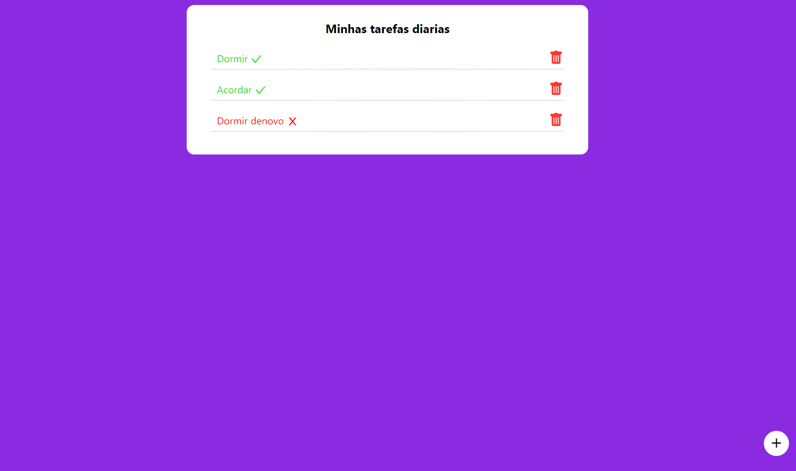

## Daily Tasks

<h4 align="center">
  Daily-Tasks is a platform to organize your routine.
</h4>



## Tecnologias

Esse projeto foi desenvolvido utilizando as tecnologias mais recentes.

- [ReactJS](https://reactjs.org/)

## 💻 Iniciando o projeto

### Requisitos

- Você precisa instalar [Node.js](https://nodejs.org/en/download/) e [Yarn](https://yarnpkg.com/) para executar esse projeto.

**Clonando o projeto e acessando o diretório**

```bash
$ git clone https://github.com/FeSilva-dev/Daily-task.git && cd Daily-task
```

**Siga os passos abaixo**

```bash
# Install the dependencies
$ npm install

# Run the web server
$ npm start
```

A aplicação estará disponível para acesso no navegador em: `http://localhost:3000`


Made with 💜 by Felipe Silva 👋 [Check out my LinkedIn](https://www.linkedin.com/in/felipe-rodrigues-191b79201/)
